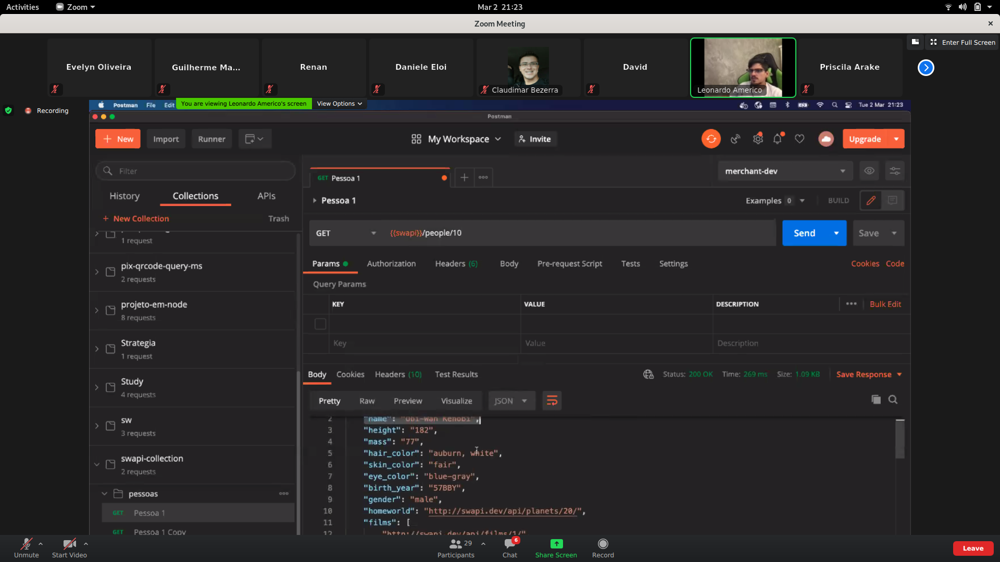

# Lista de Exercícios VIII

> À partir do dia 2 de março. Exercícios sobre a manipulação do Postman para criação de collections, variáveis de ambientes, subdiretórios e consultas com requisições.

```js

// Item 1: Criar uma collection chamada swapi-collection.

// Item 2: Criar uma variável de ambiente chamada swapi, com a base url https://swapi.dev/api e utilizar ela como base para as demais requisições.
{{swapi}}people/

// Item 3: Criar um subdiretório chamado "pessoas" que permita buscar os personagens.
<div align="center">
  
</div>
```
```js
// Item 4: Criar 3 consultas para buscar os personagens, por exemplo: "Obi-Wan, Greedo e Yoda".
// Não era necessário controlar a busca de nenhuma forma, mas é possível passar alguns parâmetros.

<div align="center">
  
</div>
```
```js
// Item 5: Criar um subdiretório chamado "naves".
{{swapi}}starships

<div align="center">
  
</div>
```
```js
// Item 6: Criar 3 consultas para buscar as naves, por exemplo: "Death Star", "Millenium Falcon" e "X-wing".
<div align="center">
  
</div>
```
```js
// Item 7: Criar um subdiretório chamado "planetas".
{{swapi}}planets

<div align="center">
  
</div>
```
```js
// Item 8: Criar 3 consultas para buscar as naves, por exemplo: "Tatooine", "Alderaan" e "Hoth".

<div align="center">
  
</div>

```